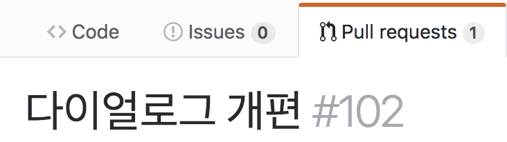

# Pull Request 를 로컬로 가져오기  
PR 리뷰를 하다보면 테스트를 위해 코드를 직접 돌려봐야할 때가 있다. 보통 Pull 을 한다고하면 원격저장소에 있는 Master 를 가져오는게 일반적이지만 PR 은 Master 에 반영되지 않은 코드이므로 PR 브랜치를 직접 Pull 해야한다. 방법은 어렵지 않으나 선결조건으로 해당 'PR의 번호'를 알고있어야 한다.  
  
PR번호는 GitHub 기준으로 다음과 같이 PR title 옆에 '#번호' 형태로 표기되어 쉽게 확인할 수 있다.  
  

  
그럼 'origin' 원격 저장소에서 번호가 '80'인 PR을 'pr-test80' 브랜치로 가져오는 작업을 수행해보자.  
  
1. Pull 을 받고자하는 Branch 를 checkout 한다.  
~~~bash
$ git checkout pr-test80
~~~  
2. PR 번호를 이용하여 원격저장소에서 PR 브랜치를 로컬로 가져온다.  
~~~bash
$ git pull origin pull/80/head:pr-test80
~~~  
  
**간단하다!**

